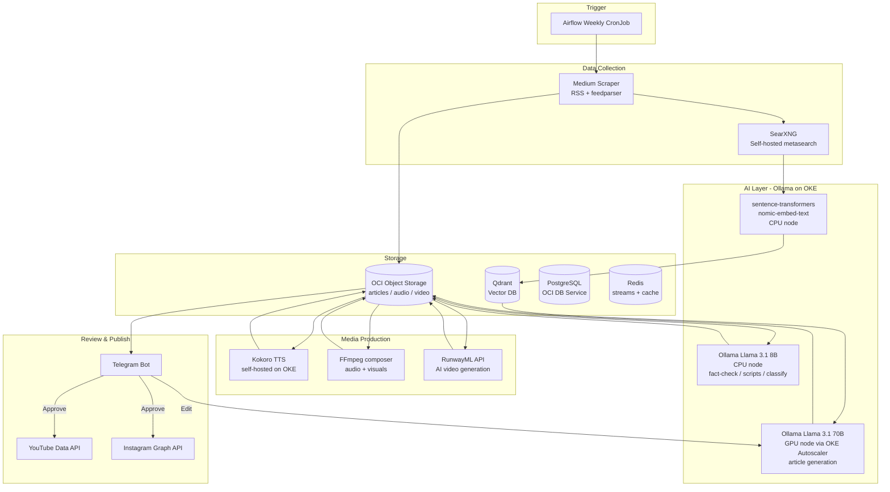
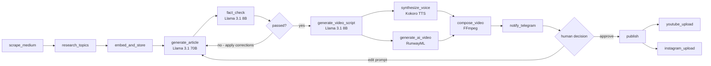

# Architecture

## Final Tech Stack

| Layer | Technology | Notes |
|---|---|---|
| **Orchestration** | Apache Airflow (Helm on OKE) | KubernetesExecutor — each task = isolated pod |
| **LLM** | Ollama on OKE (Llama 3.1) | 8B on CPU pods, 70B on GPU node via OKE Autoscaler |
| **Embeddings** | sentence-transformers on OKE | `nomic-embed-text`, CPU only |
| **Vector DB** | Qdrant (Helm on OKE) | StatefulSet + PVC |
| **Queue** | Redis Streams | Airflow state + inter-service events |
| **Database** | PostgreSQL (OCI Database Service) | Pipeline metadata, content state |
| **Object Storage** | OCI Object Storage | Articles, audio, video files |
| **Web Research** | SearXNG (self-hosted on OKE) | Open source metasearch, replaces Tavily |
| **TTS** | Kokoro TTS (self-hosted on OKE) | Best open source TTS quality |
| **Video Compose** | FFmpeg | Audio + visuals composition |
| **AI Video** | RunwayML API | Only external paid dependency |
| **Scraping** | RSS (feedparser) + Playwright | Free, no API key |
| **Telegram** | python-telegram-bot | Review + approval workflow |
| **Publishing** | YouTube Data API + Instagram Graph API | Free |
| **CI/CD** | GitLab CI + ArgoCD | Your current stack |
| **Monitoring** | Prometheus + Grafana + Loki | Your current stack |

---

## Full System Architecture



---

## Airflow DAG — Weekly Pipeline



---

## Kubernetes Layout on OKE

```
OCI OKE Cluster
│
├── Namespace: airflow
│   ├── Scheduler (Deployment)
│   ├── Webserver (Deployment)
│   └── Workers (KubernetesExecutor — pod per task, auto cleanup)
│
├── Namespace: ai
│   ├── ollama-8b   (Deployment — CPU node, always on)
│   ├── ollama-70b  (Deployment — GPU node, OKE Autoscaler scales to 0 when idle)
│   ├── embeddings  (Deployment — CPU node, always on)
│   ├── kokoro-tts  (Deployment — CPU node)
│   └── searxng     (Deployment — CPU node)
│
├── Namespace: data
│   ├── qdrant      (StatefulSet + PVC — 3 replicas)
│   └── redis       (StatefulSet + PVC)
│
├── Namespace: bots
│   └── telegram-bot (Deployment — always on, listens for messages)
│
└── Namespace: monitoring
    ├── prometheus
    ├── grafana
    └── loki
```

---

## Ollama on OKE — Node Strategy

```
CPU Node Pool (always running — VM.Standard.E4.Flex 4 OCPU ~$0.10/hr)
  └── ollama-8b, embeddings, kokoro-tts, searxng, airflow

GPU Node Pool (OKE Cluster Autoscaler — scales to 0 when idle)
  └── ollama-70b on VM.GPU.A10.1 (~$0.45/hr)
      Active only during article generation (~30 min/week)
      Estimated GPU cost: ~$0.22/week
```

---

## Data Flow in OCI Object Storage

```
oci://your-bucket/YYYY-WW/
  ├── raw/          ← scraped Medium articles (JSON)
  ├── research/     ← SearXNG results per topic (JSON)
  ├── articles/     ← generated + fact-checked article (JSON + MD)
  ├── audio/        ← Kokoro TTS output (MP3)
  ├── video/raw/    ← RunwayML AI clips (MP4)
  └── video/final/  ← FFmpeg composed final video (MP4)
```

---

## GitOps Flow (same as your Sinch pattern)

```
git push to GitLab
      │
      ▼
GitLab CI: lint → test → docker build → push to OCIR → update Helm values
      │
      ▼
ArgoCD detects Helm values change → deploy to OKE
```
